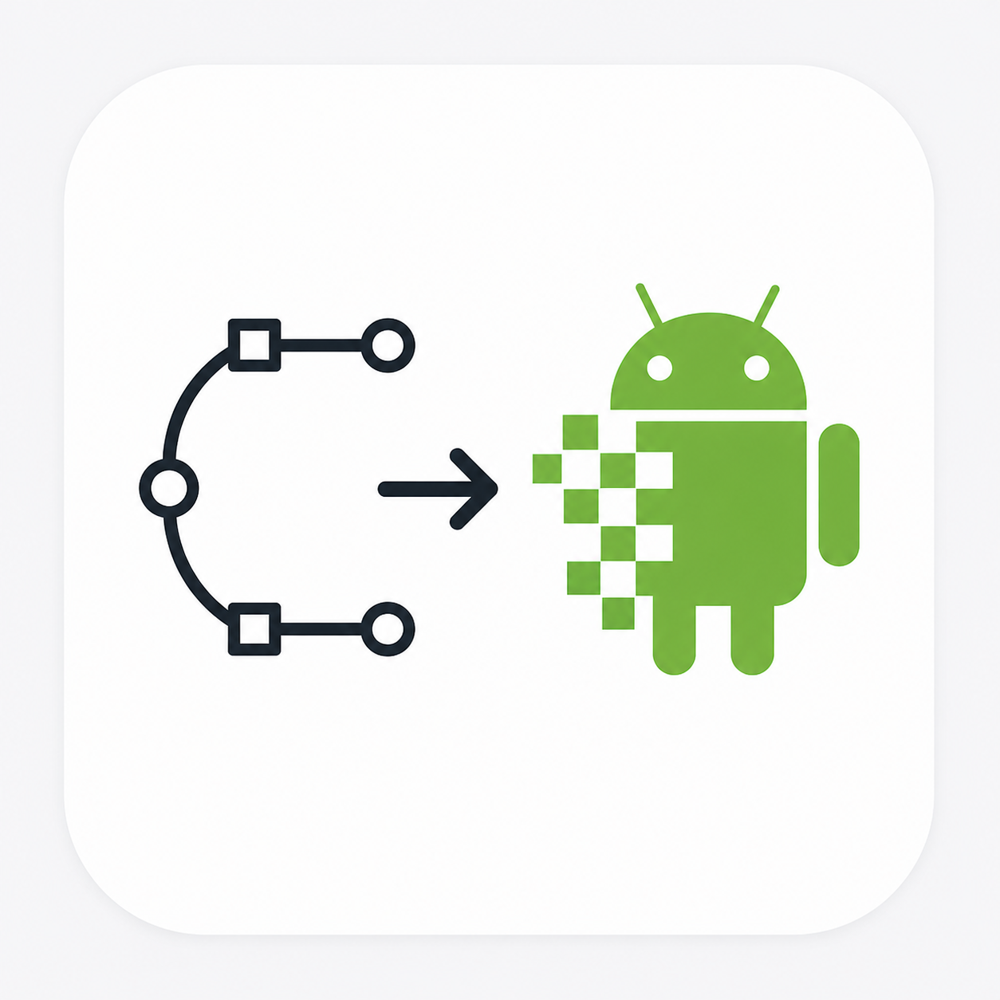

<h1><picture><source media="(prefers-color-scheme: dark)" srcset="icon_dark.png"></picture> SVG2AndroidWebP</h1>

A macOS tool that takes a single SVG file and converts it into WebP images for all 5 Android density buckets — mdpi, hdpi, xhdpi, xxhdpi, and xxxhdpi — in one go. It reads the dimensions directly from the SVG, scales them proportionally for each density, and writes the output files into the correct `drawable-<density>` folders inside your Android module.

It comes in two forms: a native macOS wizard app you can launch from Spotlight, and a command-line script for scripting or CI use.

## Requirements

The following tools must be installed on the machine running the app or script:

```bash
brew install librsvg webp
```

- **librsvg** — used to rasterize the SVG to PNG at each target resolution
- **webp** — used to encode the rasterized image as a lossless WebP file

## Dependencies

The app uses the following Python libraries:

- **pyobjc-framework-Cocoa** — native macOS UI (file pickers, dialogs)
- **xml.etree.ElementTree** (stdlib) — parses the SVG to extract width, height, and viewBox

## Download

Download the latest `svg2androidwebp.zip` from the [Releases](https://github.com/ThibaultCharr/svg2androidwebp/releases) page, unzip it, and move `svg2androidwebp.app` to your `/Applications` folder.

> First launch: right-click → Open to bypass Gatekeeper (the app is not signed with an Apple Developer certificate).

## CLI usage

`converter.py` can be used directly as a command-line script:

```bash
python3 converter.py <input.svg> <icon_name> <module_path> [options]
```

### Positional arguments

| Argument | Description |
|---|---|
| `input.svg` | Path to the source SVG file |
| `icon_name` | Android resource name (lowercase letters, digits, underscores) |
| `module_path` | Android module root — the folder containing `src/main/res/` |

### Options

| Flag | Default | Description |
|---|---|---|
| `--width W` | from SVG | Override source width in px |
| `--height H` | from SVG | Override source height in px |
| `--baseline DENSITY` | `mdpi` | Density the source dimensions represent |

`--baseline` accepts: `mdpi`, `hdpi`, `xhdpi`, `xxhdpi`, `xxxhdpi`

### Examples

```bash
# Read dimensions from SVG, mdpi baseline
python3 converter.py icon.svg ic_home libraries/Home/impl

# Custom dimensions, xhdpi baseline
python3 converter.py icon.svg ic_home libraries/Home/impl --width 64 --height 64 --baseline xhdpi
```

## Output

Files are written to:

```
<module_path>/src/main/res/drawable-<density>/<icon_name>.webp
```

The source dimensions are treated as the chosen baseline density and scaled proportionally:

| Density | Scale |
|---|---|
| mdpi | 1× |
| hdpi | 1.5× |
| xhdpi | 2× |
| xxhdpi | 3× |
| xxxhdpi | 4× |
